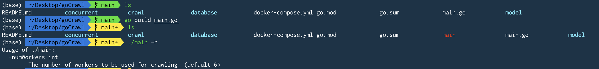
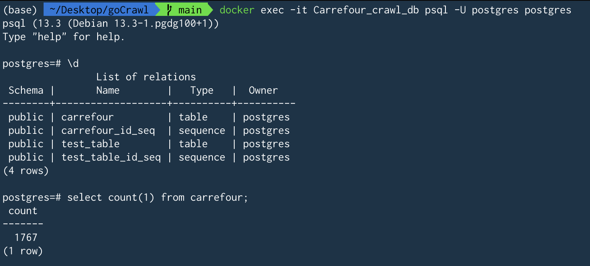
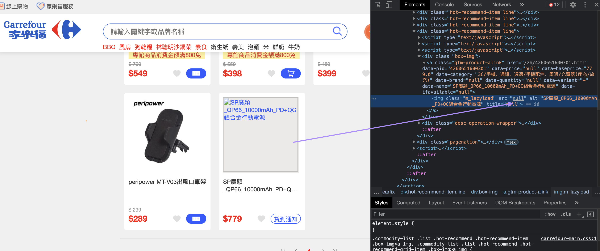

## Prerequisite: Docker 
The project users Docker to set up the postgres database. Make sure docker is installed and running before testing or running the application.

Once docker is up and running on your computer, run `docker-compose up` in the project root directory to set up the database.

---
## Running unit tests
Currently, there are unit tests in the `database` and the `crawl` directories/packages. To run them, `cd` into the respective directory and run `go test .`.

---
## Running the application
### Setting the number of workers
To set up the number of workers to use for the application, please use the `numWorkers` flag. 

For more information on the flag, you can use `-h` on the built application (steps detailed in the screenshot below).

Now you can run the application with either `./main -numWorkers={your number}` or `go run main.go -numWorkers={your number}` in the project root directory.

---
## Checking the saved data
After executing the application, you can interact with the data you saved in the database by running `docker exec -it Carrefour_crawl_db psql -U postgres postgres`.

---
## Known issues
You may see some null in the image links as the site occasionally has some broken images. 

